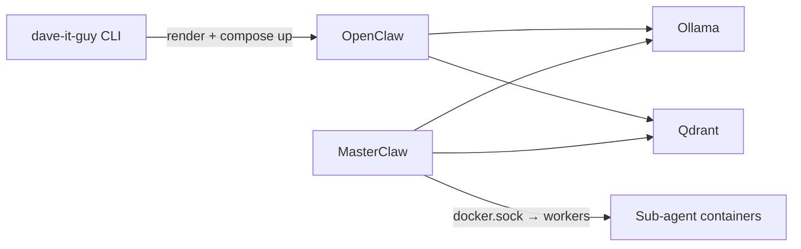

# Dave IT Guy

**Deploy local AI stacks with one command** — Docker Compose templates for **OpenClaw**, **Ollama**, **Qdrant**, and a small **MasterClaw** orchestrator that can spawn worker containers via the Docker socket.

| | |
|---|---|
| **CLI** | `dave-it-guy` (Typer) |
| **Python** | ≥ 3.9 |
| **Full command reference** | [`Commands.md`](Commands.md) |

---

## Quick start

```bash
python3 -m venv .venv
source .venv/bin/activate   # or use .venv/bin/dave-it-guy without activating
pip install -e ".[dev]"
dave-it-guy doctor
dave-it-guy deploy openclaw
```

- **OpenClaw UI:** `http://localhost:18789` (gateway port overridable with `--port`)
- **Secrets & config** land under `~/.dave_it_guy/deployments/<stack>/` (see below)

Optional: run the CLI from Docker — [`docker-compose.cli.yml`](docker-compose.cli.yml) + root [`Dockerfile`](Dockerfile) (mounts Docker socket + `~/.dave_it_guy`).

---

## What runs where (stacks)

| Stack | Role | Default host port | Main services |
|-------|------|-------------------|---------------|
| **openclaw** | Assistant + local LLM + vector DB + orchestrator | **18789** (gateway), **6333** (Qdrant), **8090** (MasterClaw) | OpenClaw, Ollama, Qdrant, MasterClaw |
| **ollama** | Ollama + Open WebUI | **3000** (WebUI), **11434** (Ollama API) | `ollama`, `open-webui` |
| **rag** | Embeddings + Qdrant + thin API | **8080** (API), **6333** (Qdrant), **8081** (embeddings) | `qdrant`, `embeddings`, `rag-api` |

**OpenClaw stack — typical flow**



- **Ollama** in the openclaw stack is **not** exposed on the host unless you pass `--ollama-port` (then `host:11434 → container:11434`).
- **MasterClaw** exposes **8090** by default (`--masterclaw-port` to change). It needs the **Docker socket** to run worker containers; treat that as high privilege.

Templates live under [`dave_it_guy/templates/`](dave_it_guy/templates/); the registry is in [`dave_it_guy/templates/__init__.py`](dave_it_guy/templates/__init__.py).

---

## Deployment directory (rendered output)

After deploy, each stack has a folder:

**`~/.dave_it_guy/deployments/<stack>/`**

| Artifact | Purpose |
|----------|---------|
| `docker-compose.yml` | Rendered Compose (from Jinja templates) |
| `.env` | API keys and env (not for git — keep permissions tight) |
| `config/` | e.g. `openclaw.json` for OpenClaw |
| `workspace/` | OpenClaw workspace bind-mount (openclaw stack) |

Edit files there and run `docker compose up -d` in that directory to apply changes.

---

## CLI entrypoints

| Command | Purpose |
|---------|---------|
| `dave-it-guy list` | List stack templates |
| `dave-it-guy deploy <stack>` | Render template and start stack (`openclaw`, `ollama`, `rag`) |
| `dave-it-guy doctor` | Docker / disk / port checks |
| `dave-it-guy status [stack]` | Container status |
| `dave-it-guy logs <stack>` | Logs (`--follow`, `--service`) |
| `dave-it-guy stop <stack>` | Stop (keeps volumes) |
| `dave-it-guy destroy <stack>` | Remove (`--volumes`, `--yes`) |
| `dave-it-guy masterclaw-tui` | TUI against MasterClaw API |
| `dave-it-guy voice` | Voice control (needs `[voice]` extra) |
| `dave-it-guy sync-openclaw-scheduler` | Sync scheduler script into deployed workspace |

Declared in [`pyproject.toml`](pyproject.toml): `dave-it-guy` → `dave_it_guy.cli:app`, plus `simple-search` for the packaged search helper.

---

## Cloud & docs

- **Azure (Terraform + cloud-init):** [`dave_it_guy/cloud/azure/openclaw/`](dave_it_guy/cloud/azure/openclaw/)
- **Contributing / tests / lint:** [`CONTRIBUTING.md`](CONTRIBUTING.md), [`Makefile`](Makefile)
- **Security notes:** [`SECURITY.md`](SECURITY.md)
- **Static site:** [`docs/site/`](docs/site/)

---


